# Spring Batch Kafka NATS POC


> **📘 Architectural Deep Dive**: For a detailed explanation of the "Hot vs Cold" path strategy, technical learnings, and component breakdown, read the [**Project Summary & Architecture Notes**](./SUMMARY.md).

---

## 🎯 Core Architecture: Hot Path vs. Cold Path

This system implements a **Hybrid Event-Driven Architecture (EDA)** that solves a fundamental trade-off in financial systems:

```
┌─────────────────────────────────────────────────────────────────────────────┐
│                      THE LATENCY vs. DURABILITY DILEMMA                     │
├─────────────────────────────────────────────────────────────────────────────┤
│                                                                             │
│   ⚡ HOT PATH (NATS)                    🧊 COLD PATH (Kafka)                │
│   ─────────────────                    ──────────────────                   │
│   • Sub-millisecond latency            • 100% message durability            │
│   • Synchronous Request-Reply          • Ordered event log                  │
│   • Ephemeral (no disk I/O)            • Replay & reprocessing              │
│   • Real-time fraud decisions          • Settlement source of truth         │
│                                                                             │
│   USE CASE: "Is this valid NOW?"       USE CASE: "Never lose this event"    │
│                                                                             │
└─────────────────────────────────────────────────────────────────────────────┘
```

### Why Two Messaging Systems?

| Scenario | Wrong Choice | Right Choice |
|----------|--------------|--------------|
| Fraud check (blocking) | Kafka (adds 10-50ms latency) | **NATS** (~1ms) |
| Transaction audit log | NATS (no persistence) | **Kafka** (durable) |
| Real-time validation | Kafka (overkill, complex) | **NATS** (simple, fast) |
| Settlement processing | NATS (can't replay) | **Kafka** (replayable) |

### The Core Value Proposition

> **Decoupling real-time validation from persistent settlement** allows each subsystem to optimize for its primary concern without compromise.

---

## Production-Ready Features

| Feature | Technology | Purpose |
|---------|------------|---------|
| **Persistence** | PostgreSQL + Flyway | Real database with schema migrations |
| **Resiliency** | Resilience4j Circuit Breaker | Graceful degradation when NATS fails |
| **Observability** | Micrometer Tracing + Zipkin | Distributed traceId across all services |
| **Testing** | Testcontainers | Integration tests with real Kafka/PostgreSQL |

---

## Architecture Overview

```mermaid
flowchart TB
    subgraph Client
        A[REST Client]
    end
    
    subgraph Gateway["Payment Gateway Service :8081"]
        B[REST Controller<br>/api/v1/payments]
        CB[🛡️ Circuit Breaker]
        C[NATS Client]
        D[Kafka Producer]
        W[WebSocket Server]
        UI[📊 Monitoring Dashboard]
    end
    
    subgraph FraudService["Fraud Stub Service :8082"]
        E[NATS Listener]
        F[Fraud Rules Engine]
    end
    
    subgraph Messaging["Message Infrastructure"]
        G[(NATS Server<br>:4222)]
        H[(Apache Kafka<br>:9092)]
    end
    
    subgraph Settlement["Settlement Batch Job :8083"]
        I[Kafka Consumer]
        J[(PostgreSQL<br>Staging DB)]
        K[Spring Batch Job]
        L[CSV Writer]
    end
    
    subgraph Observability["Observability Stack"]
        Z[(Zipkin<br>:9411)]
    end
    
    subgraph Output
        M[📁 Settlement Files<br>/output/*.csv]
    end
    
    A -->|POST /payments| B
    B -->|1. Protected call| CB
    CB -->|Request-Reply| C
    C <-->|Sync ~1ms| G
    G <-->|fraud.check| E
    E --> F
    F -->|Approve/Reject| E
    
    CB -.->|Fallback on failure| B
    
    C -->|2. If approved| D
    D -->|Async publish| H
    H -->|payments.authorized| I
    
    I -->|Stage| J
    K -->|Read pending| J
    K -->|Process & Write| L
    L --> M
    
    W -.->|Real-time logs| UI
    
    B -.->|traceId| Z
    E -.->|traceId| Z
    I -.->|traceId| Z
    
    style G fill:#27AAE1,color:#fff
    style H fill:#231F20,color:#fff
    style J fill:#336791,color:#fff
    style UI fill:#7C3AED,color:#fff
    style CB fill:#10B981,color:#fff
    style Z fill:#FF6B35,color:#fff
```



### Data Flow

1. **Payment Request** → Client submits payment via REST API
2. **Circuit Breaker** → Resilience4j protects the NATS call with fallback
3. **Fraud Validation** → Gateway performs synchronous NATS request-reply (~1ms)
4. **Event Publication** → Approved transactions published to Kafka topic
5. **Event Consumption** → Settlement service stages transactions to PostgreSQL
6. **Batch Settlement** → Spring Batch job processes staged records to CSV files
7. **Distributed Tracing** → TraceId propagates through NATS → Kafka → Batch

---

## Tech Stack Justification

### Why NATS for Fraud Checks? (Hot Path)

| Requirement | NATS Advantage |
|-------------|----------------|
| **Ultra-low latency** | Sub-millisecond message delivery |
| **Request-Reply pattern** | Native support for synchronous operations |
| **No persistence needed** | Fraud decisions are ephemeral |
| **Simple operations** | Zero configuration clustering |

### Why Apache Kafka for Event Streaming? (Cold Path)

| Requirement | Kafka Advantage |
|-------------|-----------------|
| **Durability** | Messages persisted to disk with replication |
| **Ordering guarantees** | Partition-level ordering for consistency |
| **Replay capability** | Consumer offset management for reprocessing |
| **Decoupling** | Clean separation between ingestion and processing |

### Why Spring Batch for Settlement?

| Requirement | Spring Batch Advantage |
|-------------|------------------------|
| **Chunk processing** | Memory-efficient large dataset handling |
| **Transaction management** | ACID guarantees per chunk |
| **Restart/Retry** | Built-in failure recovery |
| **Monitoring** | Job execution metrics and history |

---

## Project Structure

```
spring-batch-kafka-nats-poc/
├── pom.xml                          # Parent POM with dependency management
├── common-api/                      # Shared DTOs and events
│   └── src/main/java/com/fintech/common/
│       ├── dto/                     # PaymentRequest, FraudCheck DTOs
│       ├── event/                   # TransactionAuthorizedEvent
│       └── constants/               # Kafka topics, NATS subjects
├── payment-gateway-service/         # REST API + NATS + Kafka producer
│   └── src/main/
│       ├── java/com/fintech/gateway/
│       │   ├── controller/          # REST + Dashboard + Simulator
│       │   ├── service/             # PaymentService, NatsClient
│       │   ├── config/              # Kafka, NATS, WebSocket
│       │   └── monitoring/          # Metrics, Log streaming
│       └── resources/
│           └── static/index.html    # 📊 Real-time Dashboard (Vue.js)
├── fraud-stub-service/              # NATS listener with fraud rules
│   └── src/main/java/com/fintech/fraud/
├── settlement-batch-job/            # Kafka consumer + Spring Batch
│   └── src/main/java/com/fintech/settlement/
└── docker/
    └── docker-compose.yml           # Podman-compatible infrastructure
```

---

## Getting Started

### Prerequisites

- **Java 21** (LTS)
- **Maven 3.9+**
- **Podman** & **podman-compose** (or Docker/Docker Compose)

### 1. Clone the Repository

```bash
git clone https://github.com/your-username/spring-batch-kafka-nats-poc.git
cd spring-batch-kafka-nats-poc
```

### 2. Start Infrastructure with Podman

```bash
cd docker

# Start all services (Kafka, Zookeeper, NATS, Kafka UI)
podman-compose up -d

# Check status
podman-compose ps

# View logs
podman-compose logs -f kafka
```

> **Alternative with Docker:**
> ```bash
> docker-compose up -d
> ```

**Wait for services to be healthy** (~30 seconds):
```bash
podman-compose ps
# All services should show "healthy" status
```

**Available Infrastructure Endpoints:**

| Service | URL | Purpose |
|---------|-----|---------|
| Kafka | `localhost:9092` | Message broker |
| NATS | `localhost:4222` | Low-latency messaging |
| NATS Monitoring | http://localhost:8222 | NATS server stats |
| Kafka UI | http://localhost:8080 | Topic/consumer management |

### 3. Build the Project

```bash
cd ..
mvn clean install -DskipTests
```

### 4. Run the Services

You can start all services automatically using the provided PowerShell script or run them manually.

**Option A: Automated Script (Recommended)**
```powershell
./start-dev-env.ps1
```

**Option B: Manual Start**

Open **three terminals** and run each service:

**Terminal 1 - Fraud Stub Service (Port 8082):**
```bash
cd fraud-stub-service
mvn spring-boot:run
```

**Terminal 2 - Payment Gateway (Port 8081):**
```bash
cd payment-gateway-service
mvn spring-boot:run
```

**Terminal 3 - Settlement Batch Job (Port 8083):**
```bash
cd settlement-batch-job
mvn spring-boot:run
```

### 5. Access the Dashboard

Open your browser and navigate to:

```
http://localhost:8081
```

You'll see the **Real-Time Monitoring Dashboard** with:
- 📊 Transaction metrics (total, approved, rejected)
- ⚡ NATS fraud check latency
- 📜 Live Kafka event stream
- 🖥️ Real-time log terminal

### 6. Test the Flow

**Option A: Use the Dashboard**  
Click the **"Generate Traffic"** button to send 10-20 random payment requests.

**Option B: Manual curl requests**

```bash
# Approved payment (amount < 1000)
curl -X POST http://localhost:8081/api/v1/payments \
  -H "Content-Type: application/json" \
  -d '{
    "payerId": "CUST-001",
    "payeeId": "MERCH-001", 
    "amount": 500.00,
    "currency": "USD",
    "issuerBankId": "BANK-A",
    "acquirerBankId": "BANK-B",
    "merchantCategoryCode": "5411",
    "originCountry": "US"
  }'

# Rejected payment (amount > 1000 triggers fraud rule)
curl -X POST http://localhost:8081/api/v1/payments \
  -H "Content-Type: application/json" \
  -d '{
    "payerId": "CUST-002",
    "payeeId": "MERCH-002",
    "amount": 5000.00,
    "currency": "USD",
    "issuerBankId": "BANK-C",
    "acquirerBankId": "BANK-D",
    "merchantCategoryCode": "5411",
    "originCountry": "US"
  }'
```

**Trigger settlement batch job:**
```bash
curl -X POST http://localhost:8083/api/v1/batch/settlement/run
```

**Check generated files:**
```bash
ls settlement-batch-job/output/
cat settlement-batch-job/output/settlement_*.csv
```

---

## Service Endpoints

| Service | Port | Endpoints |
|---------|------|-----------|
| Payment Gateway | 8081 | `GET /` (Dashboard) |
| | | `POST /api/v1/payments` |
| | | `GET /api/v1/dashboard/metrics` |
| | | `POST /api/v1/simulator/generate` |
| Fraud Stub | 8082 | NATS listener (`fraud.check`) |
| Settlement Batch | 8083 | `POST /api/v1/batch/settlement/run` |
| | | `/h2-console` (Database UI) |

---

## Infrastructure Management (Podman)

### Common Commands

```bash
# Navigate to docker directory
cd docker

# Start infrastructure
podman-compose up -d

# Stop infrastructure
podman-compose down

# Stop and remove volumes (clean reset)
podman-compose down -v

# View container logs
podman-compose logs -f [service-name]

# Restart a specific service
podman-compose restart kafka

# Check resource usage
podman stats
```

### Volume Management

```bash
# List volumes
podman volume ls

# Inspect a volume
podman volume inspect spring-batch-kafka-nats-poc_kafka_data

# Remove unused volumes
podman volume prune
```

### Network Troubleshooting

```bash
# List networks
podman network ls

# Inspect the fintech network
podman network inspect fintech-network

# Test connectivity between containers
podman exec -it kafka ping nats
```

---

## Configuration

### Fraud Threshold

Edit `fraud-stub-service/src/main/resources/application.yml`:

```yaml
fraud:
  threshold:
    amount: 1000  # Transactions above this are rejected
```

### Batch Processing

Edit `settlement-batch-job/src/main/resources/application.yml`:

```yaml
settlement:
  batch:
    chunk-size: 100  # Records per transaction
  output:
    directory: ./output
```

### Kafka Connection

For Podman internal networking, services connect to `kafka:29092`.  
For external access (local development), use `localhost:9092`.

---

## Monitoring Dashboard Features

| Feature | Description |
|---------|-------------|
| **Total Transactions** | Real-time counter of all processed payments |
| **Fraud Check Latency** | NATS round-trip time in milliseconds |
| **Approval Rate** | Percentage visualization with progress bar |
| **Kafka Events Stream** | Last 10 events with status badges |
| **Log Terminal** | Linux-style terminal with color-coded logs |
| **Traffic Generator** | One-click load testing (10-20 random requests) |

---

## Troubleshooting

### Kafka Connection Issues

```bash
# Check if Kafka is healthy
podman exec -it kafka kafka-broker-api-versions --bootstrap-server localhost:9092

# List topics
podman exec -it kafka kafka-topics --bootstrap-server localhost:9092 --list

# Create topic manually if needed
podman exec -it kafka kafka-topics --bootstrap-server localhost:9092 \
  --create --topic payments.authorized --partitions 3 --replication-factor 1
```

### NATS Connection Issues

```bash
# Check NATS server status
curl http://localhost:8222/varz

# Check subscriptions
curl http://localhost:8222/subsz
```

### Service Won't Start

1. Ensure infrastructure is running: `podman-compose ps`
2. Check port availability: `netstat -an | grep 8081`
3. Review logs: `mvn spring-boot:run` shows startup errors

---

## License

This project is licensed under the MIT License.

---

## Roadmap

- [ ] PostgreSQL integration for production staging
- [ ] Kafka transactions for exactly-once semantics
- [ ] NATS JetStream for durable fraud audit logs
- [ ] Kubernetes/OpenShift deployment manifests
- [ ] Prometheus/Grafana observability stack
- [ ] Circuit breaker patterns (Resilience4j)
- [ ] OAuth2/JWT security layer

---

*Built with ❤️ for the FinTech community*
